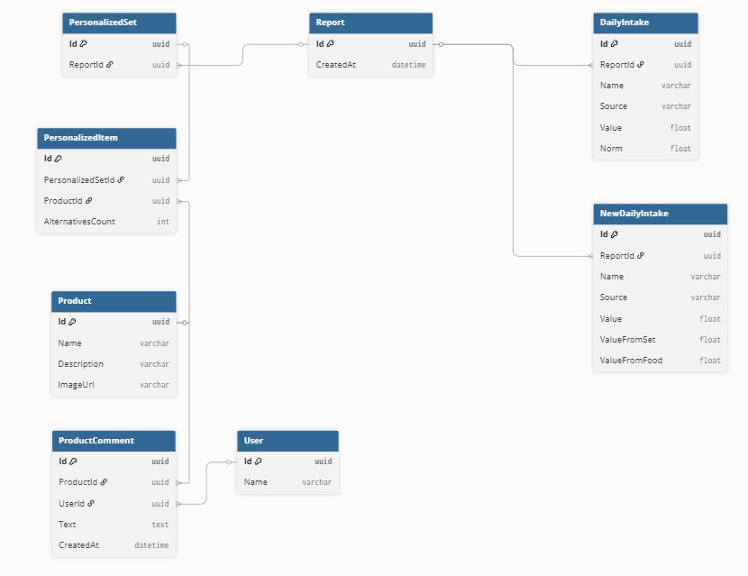

# Биогеном — Серверная часть API для оценки качества питания

## Описание

Данный проект реализует серверную часть Web API для мобильного приложения Биогеном. API предоставляет доступ к индивидуальному отчету по оценке качества питания пользователя.

---

## Ключевые особенности

- Реализованы 2 эндпоинта:
  - **GET /report** — получить последний (и единственный) отчет пользователя.
  - **POST /report** — сохранить новый отчет (удалив старый).
- Архитектура проекта разделена на два слоя:
  - **API слой** — контроллеры и модели запросов/ответов.
  - **DB слой** — модели сущностей и репозиторий для работы с PostgreSQL через EF Core.
- Тестовые данные создаются при старте проекта в классе SeedData.
- Используется база данных **PostgreSQL**.
- Построено на **.NET 9**.
- Для удобства локальной разработки и запуска используется **Docker Compose**, поднимающий приложение и PostgreSQL.

---
## Диаграмма БД


---
## Как запустить
Используйте Docker Compose
   ```bash
   docker-compose up --build
